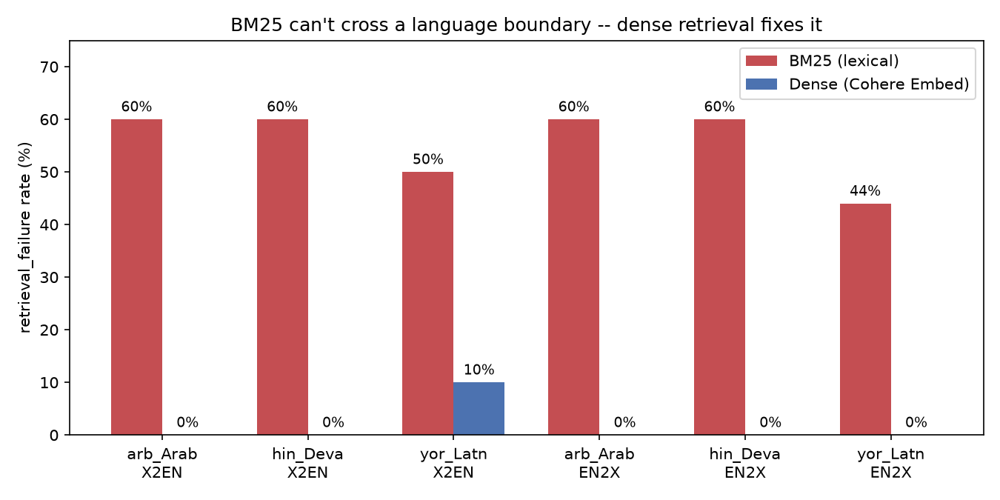

# PolyCite v1

Where does multilingual RAG break? PolyCite measures grounded-answer quality
across 8 languages on a parallel benchmark (Belebele), and attributes every
failure to a specific pipeline stage — retrieval, reranking, reading, or
citation — instead of reporting one opaque accuracy number per language.

Pre-registered hypotheses: [`HYPOTHESES.md`](HYPOTHESES.md) (committed before
any real run, so results can't be quietly reframed to fit them).

## Headline finding

**Lexical retrieval (BM25) cannot cross a language boundary; dense retrieval
(Cohere Embed) fixes it almost completely.** Querying in one language
against a passage corpus in another (X2EN/EN2X) sent BM25's
`retrieval_failure` rate to 44-60% across every tested language — the model
never even saw the right document, so no amount of prompt tuning downstream
could have fixed the answer. Swapping in dense retrieval, same questions,
same rerank/generation stages, drops that to 0-10%:



This wasn't assumed — it was diagnosed from a first live run's failure
attribution, then demonstrated with a paired before/after comparison (see
"Phase 6 intervention" in [`HYPOTHESES.md`](HYPOTHESES.md)).

## Status: first real run complete, all 4 conditions validated

This repo was scaffolded in a single day inside a sandboxed Claude Code
session with **no network access to `huggingface.co` or `api.cohere.com`**
(confirmed org egress policy denials, not a bug), then run for real on a
laptop with internet and a Cohere trial key. `make reproduce` (dry-run,
fixture data + fake transport) proves the pipeline's wiring; `make
reproduce-live` has now actually run against real Belebele data and a real
Cohere key (862 calls total across all 4 conditions plus the Phase 6 dense-
retrieval test, well under the 1,000/month trial budget).

The first live run surfaced six real bugs, all found by hand-inspecting
actual model output against gold answers (`scripts/inspect_results.py`) and
all now fixed and covered by regression tests:
- Cohere rejects document ids over 100 chars; our URL-based passage ids
  routinely exceeded that (`generate/cohere_chat.py`).
- Answer scoring used symmetric F1, which penalizes a verbose-but-correct
  answer for every extra word — switched to gold-recall
  (`generate/scoring.py`).
- Arabic-specific: ASCII-only punctuation stripping missed Arabic
  punctuation, and Arabic's attached definite article "ال" broke exact-word
  matches in both directions — both fixed with Unicode-aware normalization
  and a light per-token article strip.
- **EN2X never actually queried in English.** It relabeled the original
  non-English question as `query_language="eng_Latn"` without translating
  the text, so every EN2X row collapsed into one bucket regardless of which
  language it came from, and the "English query" was never English. Fixed
  by looking up the real English-language version of each question via
  Belebele's shared `(link, question_number)` parallel key
  (`Corpus.english_query_for`), and by adding a `corpus_language` /
  `display_language` field since EN2X's meaningful per-language axis is
  which foreign corpus was searched, not the (now-always-English) query
  language. **This one changes what's actually sent to Cohere, so re-running
  it after the fix costs new real API calls for the EN2X condition — it
  does not replay from cache like the others did.**
- Cohere's trial embed limit is token-volume-based (100k tokens/min), not
  just request-count; embedding 4 languages' full ~488-passage corpora
  back-to-back for the Phase 6 test blew past it while staying under the
  separate 100-requests/minute cap, and the existing 429 retry wasn't
  strong enough to ride out the ~60s reset. Fixed with a longer backoff cap
  and proactive pacing between embed batches (`cohere_client.py`,
  `retrieval/dense.py`).
- **X2EN's `gold_passage_id` pointed at a passage that could never be
  found.** It was `question["passage_id"]` (in language L), but X2EN
  searches an English-only pool — an L-language passage_id can never
  appear there, so retrieval was graded against a structurally impossible
  target regardless of actual quality. Found by noticing BM25 and dense
  retrieval produced *identical* X2EN failure counts, which shouldn't
  happen for two different retrieval mechanisms. Fixed by pointing
  gold_passage_id at the real English counterpart
  (`Corpus.english_query_for`, the same mechanism EN2X's fix uses in
  reverse) — see "Correction" in `HYPOTHESES.md` for what this changed.

**MONO-condition answer correctness after the scoring fixes above** (8
languages x ~9 answerable questions each, 95% bootstrap CIs are wide at
this sample size — see the "First real run checklist" before treating this
as final):

| Tier | Language | Correct | Post-rerank Recall@5 |
|---|---|---|---|
| High | eng_Latn | 0.78 | 1.00 |
| High | zho_Hans | 0.67 | 0.89 |
| High | arb_Arab | 0.67 | 1.00 |
| High | fra_Latn | 0.50 | 1.00 |
| Mid | hin_Deva | 0.12 | 0.75 |
| Mid | ben_Beng | 0.11 | 0.78 |
| Low | swh_Latn | 0.29 | 0.86 |
| Low | yor_Latn | 0.00 | 0.56 |

Directionally consistent with H1/H2: correctness degrades roughly by tier,
and Yoruba (outside Command's core supported languages) fails completely
even on the ~half of questions where the gold passage was retrieved —
suggesting a real generation-quality gap, not just a retrieval gap, is
worth investigating for that language specifically.

### The headline finding: BM25 can't cross a language boundary — and dense retrieval fixes it

Both cross-lingual hypotheses (H3, H4) were wrong in a way that converges
on one answer, and the fix for it was then tested directly, not just
diagnosed. Full verdicts, numbers, and the correction below in
[`HYPOTHESES.md`](HYPOTHESES.md); summary here:

- **H4 predicted** the MIXED condition's retrieval would over-represent
  English passages. It doesn't — it retrieves ~92-100% *same-language*
  passages for every non-English query (Arabic 100%, Yoruba 92%, etc). No
  English bias at all.
- **H3 predicted** X2EN (local query -> English docs) would outperform EN2X
  (English query -> local docs) for low-resource languages. Corrected data
  (see below) shows both directions fail at a similar, high rate under
  BM25 — no asymmetry, both walled off.
- **Why both: BM25 (pure lexical/keyword matching) essentially never
  matches a query against documents in a different language or script, in
  either direction.** Not a bias toward English — a wall between languages.

**Demonstrated, not just diagnosed:** swapping BM25 for Cohere Embed
(embed-multilingual-v3.0) on the 3 hardest-hit languages dropped
cross-lingual `retrieval_failure` from 44-60% to 0-10%, symmetrically in
both directions (X2EN and EN2X alike):

| Language | X2EN retrieval_failure | EN2X retrieval_failure |
|---|---|---|
| arb_Arab | 60% → **0%** | 60% → **0%** |
| hin_Deva | 60% → **0%** | 60% → **0%** |
| yor_Latn | 50% → **10%** | 44% → **0%** |

Answer correctness rose much less than retrieval did, though — once
retrieval stops failing, `reading_failure` becomes the dominant remaining
bottleneck (the model has the right document now and still often gets it
wrong). That's a real, distinct finding for a v2 to chase, not resolved by
this intervention.

**A correction, stated plainly:** the specific X2EN retrieval_failure
percentages first reported here were inflated by a real bug —
`gold_passage_id` pointed at a passage that could never appear in an
English-only pool, so retrieval was graded against an impossible target
regardless of actual quality. Found by noticing BM25 and dense retrieval
produced *suspiciously identical* X2EN failure counts, which shouldn't
happen for two different retrieval mechanisms. Fixed (local scoring only,
zero new API calls to reverify); H3's refutation and the "BM25 can't
cross languages" conclusion both survive with corrected numbers — see
`HYPOTHESES.md`'s "Correction" section for exactly what changed.

All 4 conditions have now been run for real (868 calls total after the
corrections, well under the 1,000/month trial budget) and their full
attribution breakdown and correctness heatmap are reproducible via
`scripts/inspect_results.py`. `results/*.parquet` is gitignored and
local-only — this README and `HYPOTHESES.md`'s verdicts section are the
durable record.

### Why does reading_failure stay high even once retrieval is fixed?

Read every `reading_failure` case (`scripts/list_reading_failures.py`, 133
rows / ~25-30 distinct questions) as an ad-hoc single-LLM judge (a
lightweight, honestly-caveated stand-in for RQ4's real native-speaker
judge validation — full writeup in `HYPOTHESES.md`). Three distinct things
are bundled into that one attribution bucket:

1. **False abstention**, concentrated specifically in EN2X — the model
   answers `NO_ANSWER` on answerable questions far more when reading a
   foreign document and answering in English than for the same question in
   MONO/MIXED. A real, testable finding, not chased further today.
2. **Genuinely wrong answers** — the majority, including MCQ items where
   the model confidently picks a different plausible wrong answer than
   Belebele's gold label.
3. **Correct answers the deterministic scorer still misses on synonyms** —
   3 clear Arabic cases (e.g. "root of problems" vs. gold "cause of
   problems") out of ~25-30 questions reviewed, ~10-17% disagreement.
   Unlike the earlier Arabic bugs, this isn't regex-fixable: literal
   token-overlap scoring can't detect synonyms. **Every correctness number
   in this README is a floor, not a precise estimate**, for this reason.

**Not yet checked**, so hold these loosely: French's 0.50 (MONO) hasn't been
hand-inspected the way Arabic and English were, and French has the same
general risk class as Arabic (elided articles like `l'eau` glue onto the
next word); sample size per language (~9-10 questions) gives wide CIs —
this is a v1 pilot, not the full n=300/language design.

### Two testable fixes for findings #1 and #3, not just more diagnosis

Diagnosing a problem twice isn't a fix. Both of the above were turned into
small, cheap, falsifiable experiments (`polycite/generate/semantic_scoring.py`,
`scripts/test_semantic_scoring.py`, `polycite/generate/prompts/answer_with_citations_anti_abstain.txt`,
`scripts/run_pipeline.py --prompt-variant anti_abstain`) — full results in
`HYPOTHESES.md`.

- **Finding #3 (synonym-blind scoring): fixed, validated, and wired up to
  actually run.** Cohere Embed cosine similarity cleanly separates the 3
  known-correct-synonym cases from 3 known-genuinely-wrong cases: RIGHT
  similarity range `[0.563, 0.583]`, WRONG range `[0.486, 0.526]` — no
  overlap, threshold ≈0.545. `scripts/rescore_semantic.py` (new) applies
  that threshold to an entire results parquet — batched, budget-checked,
  unit-tested — and reports literal-recall vs. semantic-adjusted
  correctness side by side, without touching `scoring.py`'s deterministic
  default (CLAUDE.md keeps v1 judge-free by design; this is an explicit
  supplement, run separately):
  ```
  python3 scripts/rescore_semantic.py results/live_results.parquet
  ```
- **Finding #1 (EN2X false abstention): result pending a same-scope
  baseline comparison.** The anti-abstain prompt on EN2X for
  hin_Deva/yor_Latn/swh_Latn/ben_Beng measured `false_abstention=0.64`
  (95% CI [0.48, 0.79], n=33) — but `summarize()`'s false-abstention report
  only ever broke this down by condition, not condition+language, so
  comparing that number against the *original 8-language* EN2X baseline
  would be apples-to-oranges. `scripts/compare_abstention.py` (new) filters
  both runs to the same condition+language scope and reports a paired
  bootstrap diff when the two runs share the exact same question set:
  ```
  python3 scripts/compare_abstention.py \
      results/live_results.parquet results/live_anti_abstain_results.parquet \
      --condition EN2X --languages hin_Deva,yor_Latn,swh_Latn,ben_Beng
  ```
  Whoever has both parquets locally should run this and record the verdict
  in `HYPOTHESES.md` — not yet done here because this environment doesn't
  have those result files (results/ is gitignored, generated per-machine).

## Quickstart

```bash
make install          # python3 -m pip install -r requirements.txt
make test              # 102 unit tests, no network or API key needed
make reproduce          # full pipeline on fixture data + a fake Cohere transport, $0, no key needed
```

To run for real:

```bash
python3 -m pip install datasets            # needed for the live Belebele loader
export COHERE_API_KEY=...                  # free trial key, dashboard.cohere.com/api-keys, no card needed
python3 -m polycite.data.belebele            # inspect_schema(): eyeball 3 rows before trusting anything
make reproduce-live                        # asks for confirmation before spending any calls
```

### First real run checklist (done, kept here as a record)
1. ✅ `python3 -m polycite.data.belebele` schema matched `EXPECTED_COLUMNS`
   exactly on the first try — no loader fix needed.
2. ✅ `command-a-03-2025` confirmed present via `client.models.list()`;
   `embed-v4.0` was NOT on the trial account's model list and was swapped
   for `embed-multilingual-v3.0`. `rerank-v3.5` worked in practice (a real
   rerank call would have crashed loudly if it didn't).
3. ✅ `cache/call_count.json` tracked spend correctly across the 3 re-runs
   it took to land on working scoring; each re-run after the first replayed
   entirely from cache (0 new API calls) since only local scoring logic
   changed, not the underlying prompts/model calls.
4. ✅ Free-form scoring needed real fixing, not just threshold tuning — see
   "Status" above and Limitations below for what was found and fixed.

If you're the next person running this fresh: rerun `make reproduce-live`
and compare against the correctness table in "Status" above before assuming
anything here still holds — Cohere's model catalog and Belebele's schema can
both change, and `results/*.parquet` is gitignored (regenerated locally,
never committed), so this README is the only durable record of what a past
run found.

## What this measures

**Conditions** (configs/languages.yaml): MONO (local query, local corpus),
X2EN (local query, English corpus — the realistic enterprise case), EN2X
(English query, local corpus), MIXED (local query, all 8 languages pooled —
reveals retrieval language bias).

**Languages**: eng_Latn, fra_Latn, zho_Hans, arb_Arab (high/optimized tier),
hin_Deva, ben_Beng (mid tier), swh_Latn, yor_Latn (low tier).

**Pipeline**: BM25 retrieval -> Cohere Rerank -> Cohere Chat with native
`documents=` citations -> deterministic scoring -> failure attribution.

**Metrics**: Recall@k/MRR (retrieval), answer correctness + citation
precision/recall + abstention rate (generation), all with 95% bootstrap CIs
(`polycite/analysis/stats.py`, 10k resamples, paired where the comparison is
paired — Belebele is parallel across languages, so McNemar/paired-bootstrap
apply, not independent two-sample tests).

**Signature output**: a stacked bar chart of failure stage by language
(`polycite/analysis/figures.py`), attributing each failure to exactly one of:
retrieval, reranking, reading, citation, language-fidelity, or hallucinated
confidence (answering instead of abstaining on the unanswerable split).

## Repo structure

```
polycite/
  cohere_client.py      budget-capped, cached, rate-limited Cohere wrapper — THE piece to trust
  data/                 belebele.py (live loader), build_corpus.py, fixtures.py (offline)
  retrieval/             bm25.py, dense.py, hybrid.py (RRF), metrics.py
  rerank/                cohere_rerank.py
  generate/               cohere_chat.py (native citations), scoring.py (deterministic, no judge yet)
  analysis/              attribution.py, stats.py, figures.py, tokenizer_fertility.py, language_id.py
  testing.py             deterministic fake Cohere transport, shared by tests and --mode dry-run
scripts/run_pipeline.py  orchestrator: make reproduce / make reproduce-live
scripts/rescore_semantic.py    supplemental semantic-similarity rescoring (finding #3)
scripts/compare_abstention.py  paired baseline-vs-variant false-abstention comparison (finding #1)
scripts/make_hero_chart.py     regenerates docs/assets/retrieval_fix_before_after.png from committed numbers
configs/                 languages.yaml, experiment.yaml
docs/assets/             checked-in figures referenced by README (not gitignored, unlike figures/)
tests/                   120 tests, all offline/mocked
cache/ results/ figures/ gitignored contents, regenerated by the pipeline
```

## Known v1 limitations (by design, not oversight)

- **No LLM-judge grading yet.** Answer correctness is gold-recall (does the
  gold option text's content appear in the free-form answer), thresholded at
  0.6 — a real but imperfect proxy that degrades for CJK (character-overlap
  fallback) and for morphologically rich languages where a correct
  paraphrase shares few surface tokens. Arabic's specific normalization gaps
  (punctuation, attached definite article) are fixed; other languages'
  equivalent gaps (e.g. French elision) have not been hand-checked. Judge
  validation against native-speaker labels (RQ4 in the full plan) is v2 scope.
- **Language-fidelity detection is Unicode-script-based**
  (`analysis/language_id.py`), not a real langid model (GlotLID/fastText need
  an HF download this sandbox couldn't reach). It correctly separates the 4
  non-Latin languages but cannot distinguish eng/fra/swh/yor from each other.
- **Local dense-embedding baseline and the live Belebele loader are
  untested** against real data/models — both need `huggingface.co`, unlike
  the Cohere API path, which the trial key can reach directly.
- **No MIRACL distractor corpus.** Retrieval uses Belebele's own passages per
  language (~488, same-domain hard negatives) plus the MIXED condition's
  natural pooling across 8 languages (~3,900) as the hard retrieval test,
  instead of a 20K-passage-per-language corpus — that would burn the whole
  trial-key embed budget for one experiment.
- **Generation sampled to 10 questions/language** (configs/experiment.yaml
  `budget.generation_questions_per_language`) so 8 languages x 4 conditions
  fits comfortably inside a 1,000-call/month trial key (~640 calls); the
  full design calls for 300/language. Small n means wide bootstrap CIs —
  don't over-read single-digit-percentage differences yet.

## Roadmap to v2 (once real numbers exist and/or a Cohere Labs Catalyst Grant lands)
- LLM-judge validation against ~480 native-speaker labels, per-language kappa.
- MIRACL-backed 20K-passage corpora per language.
- Real langid (GlotLID) for language-fidelity scoring.
- The intervention phase: dual-query retrieval / translate-pivot baseline,
  reporting "closes X% of the gap at +Y ms, +$Z/1k queries."
- Fresh, post-training-cutoff question split per language as a contamination check.

## License note
Belebele and MIRACL each carry their own license — check and credit both
before publishing any derived dataset built from real (non-fixture) data.
